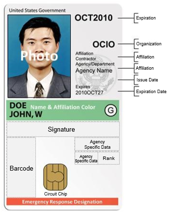

---

layout: default
title: What Is a PACS
permalink: /PACS-guide/
---

# What is a Physical Access Control System (PACS)

## Introduction
This guide is intended to provide a general overview of the Federal Information Processing Standard (FIPS) 201 Personal Identity Verification (PIV) compliant PACS that are used within the Federal government.  It will provide information on the components that make up a PACS solution, how PACS components work together to provide physical access control for Federal agencies and where these approved PACS products can be found.  In addition, this guide will discuss the benefits of PIV compliant PACS and the General Services Administration (GSA) FIPS 201 Evaluation Program’s PACS testing and why it’s needed.

1. [PACS Overview "what is a PACS"](https://github.com/thiligh/ficam-access/blob/PACS-PLABOOK-FOLDER/pages/PACS-guide.md#pacs-overview-what-is-a-pacs)
1. [Why Implement the NIST PIV Standard?](https://github.com/thiligh/ficam-access/blob/PACS-PLABOOK-FOLDER/pages/PACS-guide.md#why-implement-the-nist-piv-standard)
1. [What is HSPD-12 and what was its intended goal?](https://github.com/thiligh/ficam-access/blob/PACS-PLABOOK-FOLDER/pages/PACS-guide.md#what-is-hspd-12-and-what-was-its-intended-goal)
1. [What are some NIST PIV requirements for PACS?](https://github.com/thiligh/ficam-access/blob/PACS-PLABOOK-FOLDER/pages/PACS-guide.md#what-are-somre-nist-piv-requirements-for-pacs)
1. [What are the benefits of PIV compliant PACS?](https://github.com/thiligh/ficam-access/blob/PACS-PLABOOK-FOLDER/pages/PACS-guide.md#what-are-the-benefits-of-piv-compliant-pacs)
1. [PACS Component Categories](https://github.com/thiligh/ficam-access/blob/PACS-PLABOOK-FOLDER/pages/PACS-guide.md#pacs-component-categories)
1. [PACS Components what they are and how they work](https://github.com/thiligh/ficam-access/blob/PACS-PLABOOK-FOLDER/pages/PACS-guide.md#pacs-components-what-they-are-and-how-they-work)
1. [FIPS 201 Compliance Testing for PACS](https://github.com/thiligh/ficam-access/blob/PACS-PLABOOK-FOLDER/pages/PACS-guide.md#fips-201-compliance-testing-for-pacs)
1. [Resources](https://github.com/thiligh/ficam-access/blob/PACS-PLABOOK-FOLDER/pages/PACS-guide.md#resources)

## PACS Overview "What is a PACS"
A PACS is an electronic system that controls the ability of people and or vehicles to enter a protected area, by providing authentication and authorization mechanisms at access control points.  More specifically, PACS are electronic devices (i.e., software, hardware and firmware) used in physical access control.

Physical access control is a security method used to help prevent unauthorized access to a building, room or protected area.  It helps to ensure that only individuals who are authorized have unescorted access to these protected areas. There are many ways to provide physical access control - from the utilization of a wall or fence, to the use of a traditional lock and key solution, as seen in cars and homes today.

The most recognizable physical access control method and the one synonymous with security is the use of human security guards to protect important assets.

As technology advanced and matured, PACS have become a critical component in the Federal government’s quest to provide better physical access control.  PACS are a reliable way to provide an additional layer of security to enhance traditional physical access control methods (e.g., security guards, fences etc.), and in some instances, replace traditional methods entirely. PACS can be used to protect the outer perimeter such as entry and exit points to a building or they can be used for interior access control to a room.  

A PACS can be a proximity reader that reads the information off of a proximity card to electronically unlock a door (replacing the traditional lock and Key solution with an electronic version) or a PACS can be a very complex system, comprised of many components used to make physical access control decisions such as the PACS used in Federal facilities.  

PACS used for secure Federal buildings utilize Public Key Infrastructure (PKI) technology to help stregthen access control decisions.  PKI use public and private keys to facilitate the secure exchange of electronic information.  PKI is a process that binds public keys and identifying information (contained on certificates) to a person.  The binding is established through a process of registration and the issuance of certificates by a trusted source (i.e., Certificate Authority).  

The Federal government use Online Certificate Status Protocol (OCSP) Responders to determine if a PKI certificate has been revoked. PACS access this information to help make physical access control decisions. If a smartcard holder certificates have been revoked, the smartcard holder will be denied access into the facility. The utilization of an OCSP Responder is one of many components used to make physical access control decisions within the Federal government.  However, an OCSP Responder is normally not a component that will need to be purchased with a PACS as it should already exist as part of the Federal government’s existing PKI. 

PACS used to make access control decisions within the Federal government may consist of many components to include:

* Smartcard Reader (used to read information about a person stored on the smartcard) 

* PACS Infrastructure Controller (used to control the opening of gates and doors) 

* Secure Controller (located in a secure area and communicates with the PIV Card, Head End System, and PACS Infrastructure Controller to make access control decisions)

*	Database Server (contains the names of smartcard holders and their facility access rights) 

*	Head End System/Access Control Server (Used to register PIV Cardholders into the PACS and to refresh the controller with the latest information)

There are other components that makes up a PACS that plays an important role with making physical access control decisions.  Those  components will be discussed in more detail later in this guide.



## Why Implement the NIST PIV Standard?

The NIST FIPS 201 PIV standard contains the minimum requirements for a Federal PIV system that meets the control and security objectives of Homeland Security Presidential Directive-12 (HSPD-12).  The NIST FIPS 201 PIV standard also provides detailed specifications that will support technical interoperability among PIV systems of Federal departments and agencies.  PIV Cards that meet the NIST FIPS 201 PIV standard will be interoperable with all PIV PACS within the Federal Government.  In order to achieve interoperability within the Federal Government, all Federal agencies must configure their PACS to meet the PIV standard to support the PIV Card.

## What is HSPD-12 and what was its intended goal?

HSPD-12 is a strategic initiative intended to enhance security, increase Government efficiency, reduce identity fraud, and protect personal privacy. HSPD-12 was signed by President George Bush in 2004 due to security concerns over the wide variations in the quality and the security of the identification used within the Federal Government to gain access to secure Federal facilities.  The goal of HSPD-12 was to eliminate these variations by establishing a mandatory, Government-wide standard for secure and reliable forms of identification issued by the Federal Government to its employees and contractors.  The HSPD-12 standard that will be utilized by all Federal departments and agencies includes the vetting of individuals and the issuance of identification (e.g., Smartcards) to enhance security, reduce identity fraud, and to protect personal privacy.

## What are some NIST PIV requirements for PACS?

* PACS must be designed and configured to read and process the appropriate electronic identification information associated with an individual that is stored on a PIV Card.

*	PACS are required to be tested to ensure they meet the minimum security and interoperability requirements outlined in the NIST FIPS 201 PIV standard.

*	The PIV Card is the individual cardholders identity credential for accessing government buildings, facilities and computer networks.

* PIV PACS are required to access and validate the appropriate PIV certificate to meet the facilities security assurance level requirements.

* The assurance level required for each Federal facility will determine which certificate stored on the PIV card will be needed for physical access into that facility.  A Federal facillity may require:

  * Single Factor Authentication - Something you have (PIV Card) + visual check
  * Two Factor Authentication - something you have  (PIV Card) + something you know (PIN)
  * Three Factor Authentication - something you have (PIV Card) + something you know (PIN) + something you are (Biometric)

Note: Possession of a valid PIV Card as evidence by visual inspection of the card, reading a signed identity cert from the card, or performing challenge/response authentication with the card, provides one-factor authentication.  See examples below:  

*	PACS can perform a private key challenge/response using the Card Authentication Key (CAK) to validate the PIV Card is authentic or
*	PACS can perform a signature check of the Cardholder Unique Identifier (CHUID) to ensure it was signed by a trusted source and is unaltered and check the expiration date to ensure it’s still valid.

NIST FIPS 201 provided the opportunity to migrate building access systems from LITTLE OR NO confidence assurance levels to VERY HIGH confidence assurance levels.

## What are the benefits of PIV compliant PACS?

* PIV compliant PACS allow Federal employees and contractors to utilize the same PIV card for physical access into all Federal facilities for which they are authorized.

* Creates standardization and promotes interoperability within the Federal Government by integrating several disparate PACSs into an enterprise system

* Provides a system that promotes trust and create efficiency by rapidly authenticating credentials electronically for entering and exiting Federal facilities

* Strengthens physical security within the Federal Government

* Capable of being implemented for Federal facilities requiring high assurance personal identity verification

* Provides a stronger identification process than non-compliant PACS

* Maintain a system less susceptible to identity fraud, tampering, counterfeiting and terrorist exploitation

* Enables the PIV card to be centrally managed by the issuer, so that card loss or terminatioin results in disabling the card in any PACS database in which the card exists

## PACS Component Categories

PACS are classified in two “GSA Approved topologies” which consist of the latest and most utilized configurations within the Federal government.  These topologies are listed as 13.01 and 13.02.  This document will focus on topology 13.01 and its components which are listed under categories.  These categories of PACS are defined as part of a whole PACS solution that can be tested end-to-end by the GSA's FIPS 201 Evaluation Program.

**Topology 13.01 consist of 3 main categories:**

*	PACS PIV Reader
*	PACS Validation System
*	PACS Infrastructure

## PACS Components (what they are and how they work)

### **PACS PIV Reader Category**
A PIV Reader (i.e., smartcard reader) is a device that provides the human interface, the PIV Card interface, and the communications to and from the PACS Validation System. PACS PIV Readers have 3 types:

*	Single Factor PIV Readers – Do not allow Two Factor authentication (No PIN Pad)
*	Two Factor PIV Readers – Has a Pin Pad but no Biometric Reader
* Three Factor PIV Readers – Has Pin Pad and Biometric Reader

Example of a PIV Reader in operation: Federal employees and contractors will present their PIV Card to the PIV Reader to obtain entry into a controlled Federal facility.  The PIV Reader reads the identifying information stored on the PIV Card that is associated with the individual PIV Cardholder. It then communicates that information to the PACS Validation System.  The Validation System will validate the credentials of the individual stored on the PIV Card.  The information obtained from the PIV Card will determine if the individual will be granted physical access to the facility. A PIV Reader may be a wholly-integrated unit, or it may be an assembly of components including:

* Contact Reader (Core Component)

Communicates with the PIV smartcard using electrical signals via wires when touching (i.e., contacting) the PIV smartcard’s contact pad. 

* Contactless Reader (Core Component)

Communicates with the PIV smartcard wirelessly using Radio Frequency (RF) technology. 

* PIN Pad (Core Component)

Used in conjunction with the PIV Reader to provide two-factor authentication. Personnel will present their PIV Card to the PIV Reader, and based on the level of security required for the facility, the system may require the PIV-cardholder to enter their Personal Identification number (PIN). This provides two-factor authentication to enter the facility (something you have (PIV Card) and something you know (PIN)).  

*	Fingerprint sensor

Used with PIV Card Readers and the Pin Pad to provide 3 factor authentication. The fingerprint sensor can be used to access biometric data stored on the PIV Card to provide physical access to a Federal facility. Off-Card Biometric Comparison requires a PIN to be utilized with your finger print Biometric.  The fingerprint sensor will also require a PIN Pad to allow the PIV Card PIN to be entered.  On Card Biometric Comparison (OCC) doesn’t require a PIN Pad but no OCC Biometric reader has been submitted to the GSA for approval.  

*	Other biometric modalities 

Iris comparison is the only other allowable biometric.  As of today, no iris readers have been GSA approved. An iris scanner/reader (when approved) can be utilized to access biometric data stored on the PIV Card to provide physical access to a Federal facility. 

* LCD Display

Provide PACS visual notifications to PIV Cardholders.  Visual notifications can include error messages; proceed or stop messages or some other type of notification to alert or direct an individual. Intergrated into PACS.

* LED lights

Similar to LCD displays in that they are used to provide a visual message to the PIV Cardholder. LED lights can be used to display a green arrow to inform an individual to proceed through a gate/turnstile once a PIV Cardholder credentials have been validated and the individual is authorized and granted access to the facility. Intergrated into PACS.

*	Audio announcers

Used in PACS to provide audible alerts. Intergrated into PACS.

*	Communications to a Validation System

The PIV Reader products communicates via wires (e.g. RS-485, Ethernet) or by secure wireless, to the Validation System and other PACS devices.  Integrated into the PACS.

### **PACS Validation System**
The PACS Validation System provides the necessary functions to perform identification and authentication of the PIV Cardholder and also the PIV Card using a challenge/response process. A Validation System is made up of several compatible and interoperable components that may include:  

*	Caching status proxy server (Core Component)

Used to cache PIV-Cardholders data to optimize the performance of PACS.  It continuously validates all of the certificates captured from all of the PIV Cards stored in the PACS database so that the certifcate trust path and revocation status are immediately available when the card is presented at the PACS. 

*	Secure Controllers (Core Component)

The Secure Controller is located within a secure area.  It communicates with multiple PIV Card readers (for 1, 2 or 3 factor authentication), door actuators/PACS Infrastructure Controller (i.e., door controller), and the Head End System.  The Secure Controller receives information about the PIV Cardholder from the PIV Card reader.  Once the cardholder is identified, the Secure Controller sends the card identifier information to the PACS infrastructure controller/panel, which it uses to make access control decisions, such as to release the door locking mechanism to allow a PIV Cardholder access to a facility.  The Secure Controller communicates to the Head End System to receive changes in the PIV Cardholder access permissions to obtain updated information.  

*	PKI Validation Software (Core Component)

The PKI validation software can be part of the Caching Status Proxy Server, PKI registration and management software and secure controllers.  It verifies that the PIV Card contents are valid and have been issued by a trusted authority and it verifies that the PIV Card has not been cloned.   The PKI Validation software is used as an interface between the PIV Card reader and the secure controller as part of the PACS Validation System.  The PKI validation Software is an integrated part of the PACS.

*	PKI/PIV Card Registration and Management Software (Core Component)

Used to validate and capture demographic/PKI information from the PIV card and register the card with the PACS.  The data captured is stored in the PACS and used by the PACS PKI management software to manage the users authorization requirements to a facility.  The PIV card information validated, captured and stored into the PACS can include, the PIV cardholder's name, card number, expiration date, photo, and certificates.  The PKI registration and management software is an integrated part of the PACS.

*	Server-based Certificate Validation Protocol (SCVP) Server (Separate Component)

Used to determine whether the PIV Cardholder’s digital identification (i.e., certificate) that is stored on a PIV Card can be linked back to a trusted issuer. The SCVP Server is used for path validation and can be an extremely valuable component to a PACS. However, the use of an SCVP server is not currently mandated by policy.  An SCVP server is normally never purchased with a PACS and usually is part of the existing Public Key Infrastructure.

*	Online Certificate Status Protocol (OCSP) Responders (Separate Component)

Used to check the status of a certificate stored on a PIV Card to ensure that the certificate is valid and not revoked.  A revoked certificate is like a driver’s license that has been suspended; it cannot be used as a valid credential for physical access to a controlled Federal facility.  The PIV cardholder will be denied access by the PACS.  OCSP Responders are required but they normally already exist as part of your current Public Key Infrastructure.

### **PACS Infrastructure**
The PACS Infrastructure is made up of many compatible and interoperable hardware and software components to include:

*	Controller (field panels or door controllers) - (Core Component)

The PACS Infrastructure Controller controls the door (i.e., door locking mechanism).  The PACS Infrastructure Controller receives card identifier information about the PIV Cardholder from the Secure Controller, which it uses to make access control decisions, such as to release the door locking mechanism to allow a PIV Cardholder access to a facility.  

* PACS Application and Head End System (Core Component)

The Head End System is used to enroll an individual PIV Cardholder’s demographic information into the database, checks the PIV Card unique ID number that already exist for each individual requiring physical access, and assign access privileges and an expiration date for these privileges.  The Head End server is used to maintain this information and refreshes the Controllers with the latest changes.   
 
*	Database and Server (Core Component)

The PACS Database Server, which is part of the Head End System, contains the names of the PIV Cardholders and their unique ID number and access authorization used to gain physical access to Federal facilities.

* Workstation (Core Component)

Used with the Head End System for administration, and to register PIV Cardholder’s facility authorization into the PACS.  However, some systems use a separate PKI registration application to extract, validate and register the PIV card with the PACS.  Other systems combine the extraction and validation with their own enrollment workstation.

## FIPS 201 Compliance Testing for PACS

The GSA's FIPS 201 Evaluation Program performs compliance testing to ensure commercial products such as PACS meet Federal security standards.  These standards must be met before Federal agencies can purchase and implement commercial PACS within their infrastructure.  The FIPS 201 Evaluation Program test and certify PACS using third-party accredited testing labs, GSA managed testing labs, and National Institute of Standards and Technology (NIST) labs. The certification of PACS products is granted by either NIST or the Director of the FIPS 201 Evaluation Program after reviewing all materials and any testing results provided by the labs or product vendors. Once a product is certified, the product vendor is granted a letter of certification and the product information, version, date of certification, and any special considerations is placed on the GSA managed [Approved Products List (APL)](https://www.idmanagement.gov/IDM/IDMFicamProductSearchPage).  

Only PACS products listed on the APL are FIPS 201 PIV compliant and authorized for use within the Federal government.  For information on how to buy approved PACS products that meet the FIPS 201 PIV standard visit [How to buy a PACS](//PACS-procurement.md)

The GSA support team also work with industry to certify engineers who have passed exams for installing and configuring physical access control systems to government requirements. The training and certification is managed by the Smart Card Alliance (non-profit).

* For additional information, please visit the Smart Card Alliance [Certified System Engineer ICAM PACS Training and Certification Program](https://www.smartcardalliance.org/activities-certified-system-engineer-icam-pacs-training-and-certification-program/).

GSA has tools available to help agencies and vendors test their products and implementations. See if there are [Product Testing Tools](https://www.idmanagement.gov/IDM/s/article_detail?link=product_testing_tools) that will help you - or contact us to suggest a useful tool that you would like.

## Resources

*Will update with reference links to info on FIPS compliance testing, PACS implementation guide, & policy docs*
