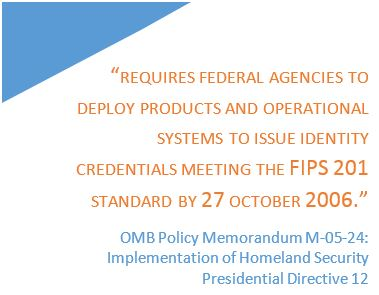
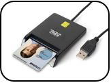
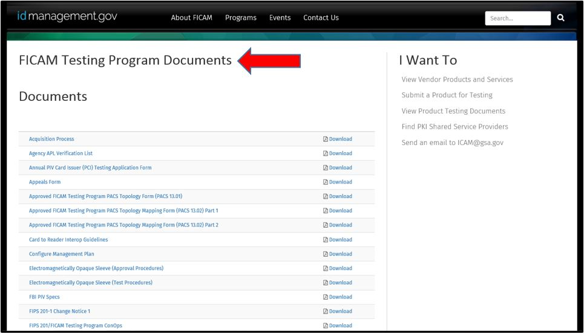

#   A BUYERS GUIDE TO PURCHASING A FEDERAL IDENTITY CREDENTIAL & ACCESS MANAGEMENT (FICAM) COMPLIANT PHYSICAL ACCESS CONTROL SYSTEM (PACS)

Buying a Federal Identity Credential & Access Management (FICAM) Compliant Physical Access Control System (PACS) can be a burdensome process.  In order to simplify the method, General Services Administration (GSA) has developed a “How To” playbook to assist Federal agencies in their procurement of E-PACS equipment.

{:style="float:right"}

## Table of Contents

[**Introduction (What is an E-PACS?)**](#introduction---what-is-an-e-pacs)

[**Stages of the E-PACS Procurement Process (What your Agency should know)**](#stages-of-the-e-pacs-procurement-process---what-your-agency-should-know)

[**Implementation: Stages of the E-PACS Procurement Process)**](#implementation--stages-of-the-e-pacs-procurement-process)

[**Need More Information?**](#need-more-information)

## Introduction - *What is an E-PACS?*

### Understanding PACS

**E-PACS** is an Enterprise Physical Access Control System.  The Federal Identity Credential & Access Management (FICAM) Compliant PACS or E-PACS (e.g., PACS) is used interchangeably within the Federal Government.  For this Playbook, the term E-PACS will be used.

An E-PACS is used to tightly control individual Personal Identity Verification PIV (PIV) cardholder (e.g., employee, contractor and visitor) access into federal buildings. For buildings with E-PACS systems installed, it ensures that only people with valid PIV cards can gain entry.  Typically they scan their card and an automated turn style allows them access. The same E-PACS technology can also be used to control individual access into interior areas within office spaces.

{:style="float:left"}

An **E-PACS**, with the addition of the PIV credential, is designed to provide a high level of confidence that “you are who you say you are” while tightly controlling physical access to federal facilities.  More importantly, E-PACS is designed to meet federal policy and standards such as Homeland Security Presidential Directive (HSPD) -12 and the Federal Information Processing Standard Publication 201 (FIPS 201). 



###  The Basics
The main purpose of this Playbook is to provide basic guidance on how to buy an E-PACS System.  This Playbook provides several purposes:
*	To provide guidance and information on PACS and their components
* To provide product, service and Shared Service Provider information
*	To provide details on schedules “what they are” and “how to access them”
*	To provide a “how to” tutorial, a step-by-step process for ordering your PACS equipment

This “How To” Playbook is designed to guide the reader through the stages of the E-PACS Procurement Process and Implementation.

### E-PACS and Their Components

An **E-PACS** can be classified as either one of two possible “topologies”.  Topologies, simply put are merely different methods for building an E-PACS system.  Currently there are two approved topologies.  These are **13.01** and **13.02.**  

* **13.01** consists of three (3) components that together make an E-PACS – these are:  E-PACS Infrastructure, E-PACS Validation System and the PIV Reader.

* **13.02** consists of two (2) main components that make an E-PACS – these are – the PIV Reader and a combined “E-PACS and Validation Infrastructure (PVI)”.

Additional details regarding PACS systems and components can be found in the [What is a PACS playbook](../pages/PACS-guide.md).

### Goal and Objectives - *The Importance of an E-PACS System*

The goal of E-PACS is to create multiple layered defenses that will make it hard for unauthorized individuals to access physical locations.  Having a PACS demonstrates:

*	***Strengthens trust*** between agencies and employees and contractors.

* ***Enhances physical security*** when individuals are entering or leaving facilities or even when individuals are working within different areas in their building.

**Bottom Line:**  ***E-PACS Delivers Enforcement of Authorized Physical Access***

### Audience - Is your Agency Ready to Buy E-PACS?

This Playbook is designed to assist federal procurement officials in acquisitions of E-PACS products and services.  Agency solutions can be specific towards products, services and/or PKI Shared Service Providers.

## Stages of the E-PACS Procurement Process - *What your Agency should know*

This section of the E-PACS procurement process is broken down into four
Stages.

*	Stage 1:  Identify E-PACS Federal Policy and Guidelines
*	Stage 2:  Define Requirements, Scope and Project Plan
*	Stage 3:  Identify and Select Approved E-PACS Products
*	Stage 4:  Procuring E-PACS Products

###	**Stage 1:**  Understanding Applicable Front-end Policy Requirements and Available Guidance

E-PACS solutions are designed to meet requirements, interoperability and conformance within the following Federal policies:

*	Homeland Security Presidential Directive (HSPD) - 12
*	Federal Information Processing Standard (FIPS) 201
*	Office of Management & Budget (OMB) Memorandum M-05-24 
*	OMB M-06-18 
*	OMB M-11-11 

> **NOTE:**  Details and descriptions of these requirements are defined in Section 3 of this Playbook.

###	**Stage 2:**  Define your Initial Requirements, Scope and Project Plan

In order for agencies to define their E-PACS requirements, the Federal Government has outlined comprehensive policy guidance, which provides specific scope and requirements for E-PACS procurement.

**Homeland Security Presidential Directive (HSPD)-12** provides guidance and requirements for Federal credentials (PIV) and Federal agencies implementing physical and logical access control systems.

####	Developing your Initial Project Plan   

Whether your agency is buying a new E-PACS or requiring an upgrade from an older E-PACS System ensuring development of a comprehensive Project Plan is essential.  Understanding and developing the scope and value of your plan is a must, along with extensive planning details.  Consider the following when building your plan:

*	Conduct Extensive Research on E-PACS Products
  *	What kind of E-PACS system does my agency need?
  *	Do I need system integrators?
*	Develop a Requirements list
*	Determine Resources Needed to Complete the Project
*	Estimate level of effort and costs associated per each phase
*	Consider time, phases and if there are any time constraints
*	Consider developing a risk assessment
  * Has my agency identified risks associated with this project?
*	Develop a Change Management Plan and implement processes
*	Policy, assure your agency is meeting their business needs, determine compliance and follow Federal policy
  
**Communication is key, ensure all senior leadership and stakeholders have a good sense of the magnitude of your project!**

##### Consider Change Management, Project Risk and Training

Define your agency activities and roles regarding managing your E-PACS and any future changes that your E-PACS system may require.  Change control should be outlined in your baseline project plan.  Provide budgets and schedules for:

*	Training
*	Maintenance
*	Warranty Agreements and/or Service Level Agreements (SLA)

### **Stage 3:**  Identify and Select Approved E-PACS Products

**OMB M-06-18** details guidance from the [GSA Approved Product List (APL)](https://www.idmanagement.gov/IDM/IDMFicamProductSearchPage).  The APL is designed to provide Federal agencies product information for procuring their E-PACS products.  All products which are listed on the APL have been approved through rigorous testing by the **FIPS 201 Evaluation Program (EP)**.

In order for Federal agencies to identify and select their E-PACS equipment they must ensure products have been approved by the APL and have completed testing through the FIPS 201 EP .  Once agencies have selected their product(s) they have the ability to research their products through the www.idmanagement.gov website. This website provides both E-PACS and non-E-PACS products and details product configuration information, along with an Approval Letter from GSA’s APL.

For technical guidance, **FIPS 201** was developed to provide specifications for components and operation of physical access control systems and how the **Personal Identity Verification (PIV)** card should be used within Federal agencies

### **Stage 4:**  Procuring E-PACS Products

E-PACS procurement can be obtained through the GSA-sponsored APL and testing information from the **FIPS 201 EP**.  Within this stage are recommended steps your agency should follow.

####	Develop your Contract and Statement of Work (SOW)

In order for your agency to procure your E-PACS products and/or solutions developing a **Statement of Work (SOW)** or **Request for Proposal (RFP)** is recommended.  GSA has provided detailed requirements and recommended language for E-PACS solutions.

It provides:

*	Contract guidance for new E-PACS systems
*	Contract guidance for upgraded E-PACS systems
*	Contract Scope of Work
*	Language for integration of FIPS 201 (authentication solutions)
*	General Requirements guidance
*	Requirements for E-PACS capabilities
*	Maintenance and Schedule
*	Quality Assurance Plan
*	Technical Specifications
*	Performance Criteria
*	Protections, Security and Safety Policy
*	FICAM Approved PACS
*	Request for Vendor E-PACS Information to provide background and details and GSA APL Approval Letter
*	Vendor Example of E-PACS Equipment
*	Vendor and Integrator Requirements
*	Execute your Contract and SOW

> **Note:**  PACS Integrators are required by Federal requirements to be certified as “**Certified System Engineer ICAM PACS**”.

## Implementation:  Stages of the E-PACS Procurement Process

This Implementation Section is divided into four stages and provides characteristics and details on the E-PACS procurement process.  It is a “how to” guide for:

*	Stage 1:  Identify E-PACS Federal Policy, Guidelines and Requirements

*	Stage 2:  Identify the E-PACS Buyer’s Guide Checklist

*	Stage 3:  Identify and Select Approved E-PACS Products and Define E-PACS Topology

*	Stage 4:  Defining the APL
  *	Finding the APL
  *	How to Use the APL
  *	Procuring Products through the APL

###	**Stage 1:** Understanding Applicable Front-end Policy Requirements and Available Guidance

#### Getting Familiar with Key E-PACS Policy Procurement Requirements

1.	The Federal Identity, Credential, & Access Management (FICAM) Roadmap and Implementation Guidance, Version 2.0 
  
  1.	Describes Implementation Guidance and Planning for Federal ICAM programs.  It provides strategies for agencies to follow when planning and developing management plans for E-PACS implementation.
  
  2.	The Roadmap details ICAM architecture and provides recommended methodology when building an agency’s architecture requirements.

1.	HSPD-12
  
  1.	Policy developed by the Federal Government to provide a common Identity Standard for Federal Employees and Contractors.  HSPD-12 establishes a mandatory standard throughout the Federal government for logical and physical access control for all Federal Employees and Contractors. 

1.	OMB Memorandum M-05-24
  
  1.	Developed by OMB to establish implementation guidance for HSPD-12 policy and FIPS 201 Guidance.  

1.	GSA Memorandum:  Acquisitions of Products and Services for Implementation of HSPD-12, August 2005

{**In Progress**}

####	Getting Familiar with Available Guidance and Resources

This section explains general guidance on:
*	FIPS 201
*	FIPS 201 Evaluation Program (EP) 

1.	**FIPS 201** - Is the National Institute of Standards and Technology (NIST)  guidance that details specifics of
the Personal Identity Verification (PIV) of Federal Employees and Contractors.  It provides standards for specifications of Federal Physical Access Control Systems (PACS).

  1.	It provides descriptions of the FIPS 201 PIV card, which is being used today for both physical and logical access control by Federal agencies 
  
  2.	FIPS 201 has two parts which consist of PIV I and PIV II.  PIV I describes standards that support security requirements and control objectives from HSPD-12.  PIV II provides specifics on standards that support the implementation of identification credentials on smart cards that are used today in PIV systems.

1.  **FIPS 201 Evaluation Program (EP)** 

{:style="float:Left"}

The **FIPS 201 Evaluation Program (EP)** is designed to admit and qualify Federal Identity and Access Management (FICAM) vendor products and services through rigorous and thorough testing. Testing is designed to ensure that vendor products/services are interoperable, provide privacy/security, are functional, and are compliant with requirements set forth by the Federal government. This means that requirements must adhere to test plans, Federal ICAM requirements and industry standards.  More importantly, testing provides Federal agencies with a more “*cost effective*” E-PACS solution.  It means that these products and services listed under the APL ***ARE*** approved through GSA’s FIPS 201 EP.

>**NOTE:**  The FIPS 201 EP details information on HSPD-12 and FIPS 201.  Through OMB Memorandum M-06-18, it provides information on the General Services Administration (GSA) and how they have established the APL.  

### **Stage 2:**  The E-PACS Buyer's Guide Checklist - *How it Works and What to Look For*

Determine your agency requirements and review Federal policy.  Does your agency need a new E-PACS infrastructure or does it require an upgrade to your existing E-PACS system?

{:style="float:Left"}

*	Buying a New E-PACS

* Upgrading your existing E-PACS

> **NOTE:**  Decide carefully on your agency selections to ensure all components on your E-PACS infrastructure “wish list” is listed on the Government APL site.  

#### Buying a New E-PACS  

*	Obtain - Senior Leadership Buy-in

*	Verify/Prepare/Determine - Plan, Budget and Funding

*	Governance – Determine agency business needs and follow Federal policy.
  *	 Perform internal risk assessment
  *	 Develop your agency E-PACS requirements list

*	Compliance – Determine agency privacy requirements and manage your requirements accordingly.

*	Review:  Federal E-PACS capabilities and agency requirements

*	Review/Determine:  Current E-PACS equipment type and stock (hardware/software)

*	Assure:  Your selection for your new E-PACS is listed on the APL

*	Find and Determine:  E-PACS information from vendors and integrators
  *	Determine if your agency requires E-PACS system integrators.
    *	Ensure system integrators are listed on the APL
    * Ensure Vendors and integrators have met qualification requirements for E-PACS services (e.g., certifications)

*	Determine:  Training requirements for agency employees on your new E-PACS system

*	Determine:  Maintenance requirements and warranty agreements for your E-PACS system

* Draft – Statement of Work for E-PACS Acquisition

#### Upgrading your Old E-PACS   

*	Obtain:  Senior Leadership Buy-in

*	Verify/Prepare/Determine:  Plan, Budget and Funding

*	Governance:  Determine agency business needs and follow Federal policy
  *	Perform internal risk assessment
  *	 Develop your agency E-PACS requirements list

*	Compliance – Determine agency privacy requirements and manage your requirements accordingly.

*	Review:  Agency and Federal E-PACS capabilities and agency requirements

*	Review/Determine:  Current E-PACS equipment type and stock (hardware/software)

*	Assure:  Your selection for an upgraded E-PACS is listed on the APL

*	Find and Determine:  E-PACS information from vendors and integrators
  *	Determine if your agency requires E-PACS system integrators.
    *	Ensure system integrators are listed on the APL
    *	Ensure Vendors and integrators have met qualification requirements for E-PACS services (e.g., certifications)

*	Determine:  Training requirements for agency employees on your upgraded E-PACS system

*	Determine:  Maintenance requirements and warranty agreements for your upgraded E-PACS system

*	Draft:  Statement of Work for E-PACS Upgrade/Replacement

### **Stage 3:**  Identify and Select E-PACS Products

As explained in Section [E-PACS and their Components](#e-pacs-and-their-components), an E-PACS has two topologies, 13.01 and 13.02.  In E-PACS Topology 13.01, it is defined through 3 major categories.  Below is a listing of E-PACS component categories detailing the different types of components or infrastructure your agency can choose from.

* **E-PACS Infrastructure** – Multiple interoperable software and hardware components that includes software applications, servers, databases, door controllers and workstations. (Topology 13.01)

* **E-PACS Validation System** – Electronic Authentication of Cards and Card Holders.  (Topology 13.01)

* **E-PACS Infrastructure and Validation Infrastructure** – Includes the E-PACS Infrastructure and functions used to perform identification and authentication of individuals (including the registration and management software). The Validation Systems uses the PIV card.  (Topology 13.02)

*	**E-PACS PIV Reader** – Used to perform CAK-Authentication.  The PIV Reader has 3 subcomponents.  (Topology 13.01)
{:style="float:left"}

  *	PIV with Single Factor – A PIV card with no identification capabilities for the person, only identifies the card.

  *	PIV with Dual Factor – A PIV card with a PIN (something you know and something you have)

  *	PIV with 3 Factor – A PIV card with a Biometric (something you have, something you know and something you are)

Additional details regarding E-PACS systems and their components can be found in the [What is a PACS](../pages/PACS-guide.md)

### Stage 4:  Where do I find Approved E-PACS Products and Services?

The Approved Products List (APL) is managed by the GSA and is part of the FIPS 201 Evaluation Program.  The APL was developed so that Federal agencies would have a “one stop shop” for information on Federal Identity, Credential & Access Management (FICAM) products and services when implementing an E-PACS system or needing vendor services.

##### Finding the APL and what’s on it?

The Approved Product List (APL) shows products and services by category.  It has a filtering mechanism to help you choose what type of product your agency needs.  The Approved Products List can be accessed at http://idmanagement.gov.  This section discusses how to navigate through the APL and idmanagement.gov site to locate useful information and relevant resources.

>**Example:** My agency is looking for a E-PACS and Validation Infrastructure System.  This information is located under the **`For Agencies`** Section.  

In this case, you are looking for an E-PACS product.  Look for the **`Find Approved Products or Services`** tab (on the left part of the page) and then select the category that meets your agency needs.
Listed below is where your agency can find the E-PACS information:
https://www.idmanagement.gov/IDM/s/

>The above page is what you should see on your screen.  

The **`Filter by Category`** dropdown list shows the available Product Categories: 

* Electromagnetically Opaque Sleeve
*	Electromagnetically Opaque Sleeve (Display)
*	Electromagnetically Opaque Sleeve (Transport)
*	OCSP Responder
*	PACS Infrastructure
*	PACS PIV Reader
*	PACS Validation System
*	PACS and Validation Infrastructure
*	PIV Card
*	SCVP Client *
*	SCVP Client (without auth.)

You can then go to the “Product Name” column and choose your selection from the product rows.

Once you have chosen your specific product, the page displays several entries from which to choose, they contain the following columns:  

*	Product Name
*	Supplier
*	Category
*	APL Number
*	Status
*	Valid Date (and if there are restrictions)

For this example, we have chosen **“PACS Infrastructure for Tyco Security Products CCURE 9000”**.

When you select the plus icon (located to the left of the product name), it provides additional details of the various components within your selected product’s infrastructure.



After finding your product selection, if you would like additional details regarding the selected product, click the highlighted APL number.  The following information is given:

If your agency needs to obtain a copy of the Product Approval Letter, it is located on this page.  Just “select” the Approval Letter icon.

Additional product configuration details can be viewed by clicking the plus icon next to **`Product Configuration`**
Clicking the **`PACS Configuration`** plus icon will display a list of PACS component configurations the product has been tested and approved to work with.

After you select either the Product Configuration or the PACS Configuration, the following product information is displayed.

#### Step 3 – “Finding FICAM Testing Program Documents”

If your agency needs to view FICAM Testing Program documents, you can view them from the idmanagement.gov Approved Product List main page.  Just select **`About FICAM`** and then select **`Document Library`**.  Thhis will direct you to the [Document Library page](https://www.idmanagement.gov/IDM/s/document_library).

On the right of this page you will see a column titled *I Want To*. Under this, select **`View Product Testing Documents`**.

Which brings your agency to your “target” page, [FICAM Testing Program Documents](https://www.idmanagement.gov/IDM/s/article_content_old?tag=a0Gt0000000Sfwt), shown below.

## Need More Information?

The Federal Government and GSA have multiple information resources your agency can utilize when researching information for procuring your E-PACS equipment.
The listings below provide resources and Point of Contact(s) (POC) for your agency and provides assistance in locating PACS information.

##### [Federal Policy and Publications](#federal-policy-publications-and-standards)
##### [GSA Acquisition Information and Schedules](#general-services-administration-gsa-and-ficam-information)
##### [PACS Point of Contact(s)](#pacs-points-of-contact-poc)

#### Federal Policy, Publications, and Standards

* [Homeland Security Presidential Directive 12, 27 August 2004](https://www.dhs.gov/homeland-security-presidential-directive-12)

* [Office of Management and Budget (OMB) Memorandum M-06-18, Acquisition of Products and Services for Implementation of HSPD-12, 30 June 2006](http://www.whitehouse.gov/sites/default/files/omb/memoranda/fy2006/m06-18.pdf)

* [Office of Management and Budget (OMB) Memorandum M-11-11, 3 February 2011](http://www.whitehouse.gov/sites/default/files/omb/memoranda/2011/m11-11.pdf)

*	[Federal Information Processing Standard 201-2, Personal Identity Verification (PIV) of Federal Employees and Contractors](http://csrc.nist.gov/publications/PubsFIPS.html)

#### General Services Administration (GSA) and FICAM Information

* [GSA Approved Products List (APL)](http://idmanagement.gov/approved-products-list-apl)

* [FICAM Personal Identity Verification (PIV) in Enterprise Physical Access Control Systems (E-PACS), DRAFT, Version 2.0.2, 24 May 2012](http://idmanagement.gov/ficam-testing-program)

#### PACS Points of Contact (POC)

* US General Services Administration (GSA)
  * **Website:**  IDManagement.gov
  * **Email:**  ICAM@gsa.gov
