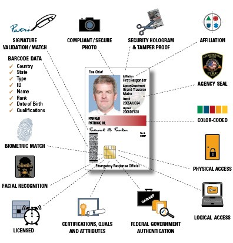

#   A BUYERS GUIDE TO PURCHASING A PHYSICAL ACCESS CONTROL SYSTEM (PACS)

Buying a Physical Access Control System (PACS) can be a burdensome process.  In order to simplify the method, General Services Administration (GSA) has developed a “How To” playbook to assist Federal agencies in their procurement of PACS equipment.

This Playbook is designed to assist federal procurement officials in acquisitions of PACS products and services.  Agency solutions can be specific towards products, services and/or PKI Shared Service Providers.

{:style="float:right"}

## Introduction

####Understanding PACS

**PACS** is a Physical Access Control System.  It is used to tightly control individual Personal Identity Verification PIV (PIV) cardholder (e.g., employee, contractor and visitor) access into federal buildings. It can also be used to control individual access into interior areas within office spaces.

{:style="float:left"}

A **PACS**, with the addition of the PIV credential, is designed to provide a high level of confidence that “you are who you say you are” while tightly controlling physical access to federal facilities.  More importantly, PACS is designed to meet federal policy and standards such as Homeland Security Presidential Directive (HSPD) -12 and the Federal Information Processing Standard Publication 201 (FIPS 201). 



Additional details regarding PACS systems and components can be found in the [What is a PACS](../pages/PACS-guide.md) playbook.

## Overview

####  The Basics
The main purpose of this Playbook is to provide basic guidance on how to buy a PACS System.  This Playbook provides several purposes:
*	To provide guidance and information on PACS and their components
* To provide product, service and Shared Service Provider information
*	To provide details on schedules “what they are” and “how to access them”
*	To provide a “how to” tutorial, a step-by-step process for ordering your PACS equipment

## Description

#### What your Agency should know

This section explains general guidance on:
*	The Federal Information Processing Standard (FIPS) 201
*	FIPS 201 Testing Program
*	FIPS 201 Evaluation Program (EP)
*	The Approved Product List (APL)
*	PACS and their Components
*	GSA Schedules (for approved PACS equipment)

## FIPS 201
**FIPS 201** is guidance provided by NIST that details specifics of the Personal Identity Verification (PIV) of Federal Employees and Contractors.  It provides standards for specifications on Federal Physical Access Control Systems (PACS).  **FIPS 201** provides descriptions on how the PIV card is implemented through Federal agencies.

**	FIPS 201 Testing Program

{:style="float:left"}

The FIPS 201 Testing Program is design to admit and qualify Federal Identity and Access Management (FICAM) vendor products and services through rigorous and thorough testing. Testing is designed to make sure that vendor products/services are interoperable, provide privacy/security, are functional, and are compliant with requirements set forth by the Federal government. This means that requirements must adhere to test plans, Federal ICAM requirements and industry standards.  More importantly, testing should provide Federal agencies with a more “*cost effective*” PACS solution.

##	FIPS 201 Evaluation Program (EP)

The **FIPS 201 Evaluation Program** details information on HSPD-12 and FIPS 201.  Through OMB Memorandum M-06-18, it provides information on the General Services Administration (GSA) and how they have established the APL.  These products and services listed under the APL have been approved through GSA’s FIPS 201 Evaluation Program.

##	Approved Products List (APL)       idmanagement.gov

The **Approved Products List (APL)** is managed by the GSA and is part of the FIPS 201 Evaluation Program.  The **APL** was developed so that Federal agencies would have a “one stop shop” for information on Federal Identity, Credential & Access Management (FICAM) products and services when implementing a PACS system or needing vendor services.

##	PACS Components

#### Choosing your Infrastructure

Below is a listing of **PACS** component categories detailing the different types of components or infrastructure your agency can choose from.  Be sure to make careful selections and ensure all components on your PACS infrastructure “wish list” is listed on the Government APL site.

*	**PACS Infrastructure -** Multiple interoperable software and hardware components that includes software applications, servers, databases, door controllers and workstations.

{:style="float:right"}

*	**PACS Validation System –** Electronic Authentication of Cards and Card Holders.

*	**PACS Infrastructure and Validation Infrastructure –** Includes the PACS Infrastructure and functions used to perform identification and authentication of individuals (including the registration and management software). The Validation Systems uses the PIV card. 

*	**PACS PIV Reader –** Used to perform CAK-Authentication.  The PIV Reader has 3 subcomponents.

{:style="float:left"}

*	PIV with Single Factor – A PIV card with no identification capabilities for the person, only identifies the card.

*	PIV with Dual Factor – A PIV card with a PIN (something you know and something you have)

*	PIV with 3 Factor – A PIV card with a Biometric (something you have, something you know and something you are)

## GSA Schedules

#### Where do I find PACS Product or Vendor Schedule Information?

**GSA Schedules** is a site which contains listed of schedules and is located at the **eLibrary** page. Through this website you can locate the Schedule Item Number (SIN) for your PACS equipment.  PACS equipment can be located on either Schedule 70 or Schedule 84.

#### Why GSA Schedules?

*	Provides fast product and/or service acquisitions (using GSA Advantage)

*	Lowers the Cost

## eLibrary 

The **eLibrary** is a GSA Federal Acquisition Service website.  It features contactor listings for IT Schedules and provides information for both Schedule 70 ad 84 acquisitions.  You can search for supplies and services for your agency through categories and a SIN.  You can also view contract clauses within the GSA eLibrary.

## [GSA Advantage](https://www.gsaadvantage.gov/)

The GSA Advantage Ordering System and Schedules 84 and 70 are online shopping catalogues used by agencies to purchase equipment and services.  It is used by agencies to procure compliant products and/or services that are listed on the APL for FICAM products.  Within these schedules, it is also possible for an agency to obtain quotes from vendors. These schedules are an easy way for agencies to procure vendor products and services.  The GSA Advantage Ordering System is located through the [GSA Advantage webpage](https://www.gsaadvantage.gov/advantage/main/start_page.do). 

#### What are the Differences between GSA Schedule 70 and 84?

* **Schedule 70:**  The Government’s largest hub for procuring vendor product/service(s).  Their acquisition service displays numerous vendor information technology merchandise and services, as well as other products.

    *	Per OMB 06-18, GSA’s acquisition guidance recommends using Schedule 70, SIN 132-62 for purchasing approved HSPD-12 products and/or services.  In addition, it recommends using Schedule 70, SIN 132-61 for agencies needing PKI Shared Service Providers for integration of their purchase of approved HSPD-12 products.

*	**Schedule 84:**  Another widely used acquisition service which is used for purchasing security and law enforcement equipment.  In particular, this schedule can also be used by agencies for the acquisition of **PACS** products and services.  

##  INFORMATION GATHERING (For Approved PAC Systems)

#### Where do I find Information on Approved PACS Products and Services?

Listed below is information located on **idmanagement.gov** and **GSA** websites.  This site details how to navigate directly to your PACS products and services.

These products and services are approved through the FIPS 201 EP once they’ve completing specific evaluation and testing criteria.  Federal agencies can use the GSA Schedules to purchase a product or service that is on the APL.

##### [Looking for APL Information on FICAM Products?](https://www.idmanagement.gov/IDM/IDMFicamProductSearchPage)

#####	[Where do I Find Products/Services through GSA websites?](https://www.gsa.gov/portal/category/26760)

Several links are provided so agencies can find their GSA schedule information and purchase resources for GSA Advantage and GSA eLibrary.  



##### [Looking for a “How to” Guide for Ordering from Schedule 70?](https://www.gsa.gov/portal/content/198589#who)

If your agency has questions on ordering a product or service from IT Schedule 70, the GSA website can provide you with additional information detailing:

  * Purchasing
  * Ordering Processes and Procedures
  * Product Research 
  * Ordering through Schedule 70
    
#####	[Where can I find information on the GSA Advantage Ordering System?](https://www.gsa.gov/portal/content/104677)

Your agency can review supplies and services directly through the GSA Portal.  When inside the portal, your agency can find their products and pricing through the guide linked above.

*	“Shop by Category” Tab, “then go to”
*	Security and Law Enforcement tab, “then go to”
*	Security Systems Integration and Design Systems tab.

#####	[Where can I find GSA Schedules and Schedule Numbers?](https://www.gsa.gov/portal/content/196585)

Once inside the GSA Portal, your agency can view the Schedule and Schedule Numbers.

##### [Looking for GSA Schedule 70, SIN 132-61 – PKI Shared Service Provider Program?](https://www.gsaadvantage.gov/advantage/s/search.do?q=0:2SIN+132+61&db=1&searchType=2)

Once inside GSA **Schedule 70**, your agency can view the Schedule and Schedule number for the following approved PKI Shared Service Providers.

##### [Looking for GSA Schedule 70, SIN 132-62 – Homeland Security Presidential Directive 12 Product and Service Components?](https://www.gsaadvantage.gov/advantage/s/search.do?q=0:2SIN+132+62&db=1&searchType=2)

Once inside GSA **Schedule 70**, your agency can view the Schedule and Schedule number for the following products, services or contractor managed services or acquisition of integrated solutions.

##### Looking for GSA Schedule 84?

#####	Looking for GSA Schedule 84, SIN 246-35-7 – Physical Access Control Systems (PACS) FIPS 201 APL?

##### [Looking for GSA Schedule 84, SIN 246-60-6 – Security System Integration, Design, Management and Life Cycle Support?](https://www.gsaadvantage.gov/advantage/s/search.do?q=0:2SIN+246+60+5&db=1&searchType=2)

## THE PACS BUYERS CHECKLIST

#### How it Works AND What to Look for

{:style="float:right"}

First, determine your agency requirements and review Federal policy. Does your agency need the entire PACS infrastructure or does it **only** require an upgrade?

#### Choose your Agency Infrastructure

The PACS components and infrastructure, which is listed in **\[Section XXXX\]** , is needed to determine what kind of PACS your agency needs.  Determine if your agency needs a new PACS or if you are just upgrading your old PACS equipment.  

####	Buying a New PACS  (Know Your Agency Needs)

*	Obtain - Senior Leadership Buy-in
*	Prepare - Planning, Budget and Funding
*	Governance – Determine agency business needs and follow agency and Federal policy.

  *	 Perform internal risk assessment
  *	 Develop your agency PACS requirements list

*	Compliance – Determine agency privacy requirements and manage your requirements accordingly.
*	Draft – Statement of Work for PACS Acquisition

####	Upgrading your Old PACS  (Know Your Agency Needs)

*	**Verify:**  Agency or Federal policy changes

*	**Determine:**  Agency budget constraints

*	**Review:**  Agency and Federal PACS capabilities and requirements

*	**Review and Determine:**  Current PACS equipment type and stock (hardware/software)

*	**Assure:**  Your selection for an upgraded PACS is listed on the APL

*	**Find and Determine:**  PACS information from vendors and integrators

  *	**Determine:** if your agency requires PACS system integrators

    *	Ensure system integrators are listed on the APL (if needed)

    *	Ensure Vendors and integrators have met qualification requirements for PACS services (e.g., certifications)

*	**Determine:**  If your agency needs training for your upgraded PACS system

*	**Determine:**  If your agency has requirements for maintenance and warranty agreements

*	**Draft:**  Statement of Work for PACS Upgrade or Replacement

##	GOALS and OBJECTIVES        

#### The Importance of a PACS System and Why My Agency Needs it

The goal of PACS is to create multiple layered defenses that will make it hard for unauthorized individuals to access physical locations.  Having a PACS demonstrates:

*	**Strengthens trust** between agencies and employees and contractors.

*	**Enhances physical security** when individuals are entering or leaving facilities or even when individuals are working within different areas in their building.

**Bottom Line:  PACS Delivers Enforcement of Authorized Physical Access**

Need More Information?



##### [Federal Policy and Publications](#federal-policy-and-standards)
##### [GSA Acquisition Information and Schedules](#general-services-administration-(gsa)-and-ficam-information)
##### [PACS Point of Contact(s)](#pacs-points-of-contact-(poc))

#### Federal Policy and Standards

* [Homeland Security Presidential Directive 12, 27 August 2004](https://www.dhs.gov/homeland-security-presidential-directive-12)

* [Office of Management and Budget (OMB) Memorandum M-06-18, Acquisition of Products and Services for Implementation of HSPD-12, 30 June 2006](http://www.whitehouse.gov/sites/default/files/omb/memoranda/fy2006/m06-18.pdf)

* [Office of Management and Budget (OMB) Memorandum M-11-11, 3 February 2011](http://www.whitehouse.gov/sites/default/files/omb/memoranda/2011/m11-11.pdf)

*	[Federal Information Processing Standard 201-2, Personal Identity Verification (PIV) of Federal Employees and Contractors](http://csrc.nist.gov/publications/PubsFIPS.html)

#### General Services Administration (GSA) and FICAM Information

* [GSA Approved Products List (APL)](http://idmanagement.gov/approved-products-list-apl)

* [FICAM Personal Identity Verification (PIV) in Enterprise Physical Access Control Systems (E-PACS), DRAFT, Version 2.0.2, 24 May 2012](http://idmanagement.gov/ficam-testing-program)

* [GSA Schedule 132-62, Homeland Security Presidential Directive 12 Product and Service Components](https://www.gsaadvantage.gov/advantage/s/search.do?q=0:2SIN+132+62&db=1&searchType=2)

* [GSA Schedule 70, Guide to Ordering from Schedule 70](https://www.gsa.gov/portal/content/198589#who)

* [GSA Advantage Ordering System](https://www.gsaadvantage.gov/advantage/main/start_page.do)

*	[GSA Portal](https://www.gsa.gov/portal/content/196585)

*	[GSA Schedule 70, SIN Number 132-61 – PKI Shared Service Provider Program](https://www.gsaadvantage.gov/advantage/s/search.do?q=0:2SIN+132+61&db=1&searchType=2)

*	[GSA Schedule 84, SIN Number 246-35-7, Physical Access Control Systems (PACS) FIPS 201 APL](https://www.gsaadvantage.gov/advantage/s/search.do?q=0:2SIN+246+35+7&db=1&searchType=2)

*	[GSA Schedule 84, SIN Number 246-60-5, Security System Integration, Design, Management, and Life Cycle Support](https://www.gsaadvantage.gov/advantage/s/search.do?q=0:2SIN+246+60+5&db=1&searchType=2)

#### PACS Points of Contact (POC)

* US General Services Administration (GSA)
  * **Website:**  IDManagement.gov
  * **Email:**  ICAM@gsa.gov

* Schedule 84 Contracting Officer
  * Mr. Daniel Stafford
  * **Email:**  Daniel.stafford@gsa.gov
  * **Phone:**  817-850-8278

* Schedule 70 Contracting Officer
  * **[To be updated]**

* Office of IT Schedule Programs
  * **Address:**  1800 F Street NW, Washington, DC  20405
  * **Website:**  ITCSC@gsa.gov

## APPENDIX A-------STILL IN DEVELOPMENT-----Placeholder for the Playbook Tutorial Guide>>>>>>>

This part of the playbook will be a tutorial with screen shots to help individuals navigating through idmanagement.gov for 
APL product/services and GSA Schedule information.

{:style="float:right"}

{:style="float:left"}

#### Step 1 – “Finding the APL”

The **Approved Product List (APL)** shows products and services by category.  It has a filtering mechanism to help you choose what type of product your agency needs.

The Approved Products List can be accessed at: https://www.idmanagement.gov/IDM/IDMFicamProductSearchPage

#### Step 2 – “Where to Find my PACS Equipment on the APL”

>**Example:** My agency is looking for a PACS and Validation Infrastructure System.  This information is located under the **`For Agencies`** Section.  
In this case, you are looking for a PACS product.  Look for the **`Find Approved Products or Services`** tab (on the left part of the page) and then select the category that meets your agency needs.
Listed below is where your agency can find the PACS information:
https://www.idmanagement.gov/IDM/s/

>The above page is what you should see on your screen.  

The **`Filter by Category`** dropdown list shows the following PACS Categories: 

* **[list of categories to be included in future update]**

You can then select the category of PACS equipment you wish to view.
Once you have chosen your specific PACS category, the APL displays a list products for that category along with the following information for each:

*	Product Name
*	Supplier
*	Category
*	APL Number
*	Status
*	Valid Date (and if there are restrictions)

For this example, we have chosen “PACS Infrastructure for Tyco Security Products CCURE 9000”.

When you select the plus icon (located to the left of the product name), it provides additional details of the various components within your selected product’s infrastructure.



After finding your product selection, if you would like additional details regarding the selected product, click the highlighted APL number.  The following information is given:

If your agency needs to obtain a copy of the Product Approval Letter, just click the Approval Letter icon.
Additional product configuration details can be viewed by clicking the plus icon next to **`Product Configuration`**
Clicking the PACS Configuration plus icon will display a list of PACS component configurations the product has been tested and approved to work with.

After you select either the Product Configuration or the PACS Configuration, the following product information is displayed.

#### Step 3 – “Finding Program Documents”

If your agency needs to view FICAM Testing Program documents, you can view them from the idmanagement.gov Approved Product List main page.  Just select **`About FICAM`** and then select **`Document Library`**.  Thhis will direct you to the [Document Library page](https://www.idmanagement.gov/IDM/s/document_library).

On the right of this page you will see a column titled *I Want To*. Under this, select **`View Product Testing Documents`**.

Which brings your agency to your “target” page, [FICAM Testing Program Documents](https://www.idmanagement.gov/IDM/s/article_content_old?tag=a0Gt0000000Sfwt), shown below.

#### Step 4 – “Finding FPKI Approved Providers”

In this example, an agency needs information about PKI Shared Service Providers.   This information can be found at the [FPKI Approved Providers](https://www.idmanagement.gov/IDM/s/article_content_old?tag=a0Gt0000000XRrC) page.  This page contains all the contact information an agency needs relating to PACS products and their vendors.
To get there, go back to where we first began, at the main page:  idmanagement.gov

Once there, under the section titled **`For Agencies`**, select **`Find Approved Federal PKI Providers`**, indicated above.

This will bring you to your “Destination” page as shown below.

#### Step 5 – “Finding MORE Information”

Additional Links to PACS information can be found on the [Contact Us](https://www.idmanagement.gov/IDM/s/article_detail?link=contact-us) page by clicking the **`Contact Us`** tab at the top of the page, shown below.

## >>>>>>STILL IN DEVELOPMENT>>>>>>>>>

**NEXT TUTORIAL:**
* LISTS of GSA SCHEDULES – A “HOW TO” IN FINDING YOUR AGENCY PACS EQUIPMENT”

