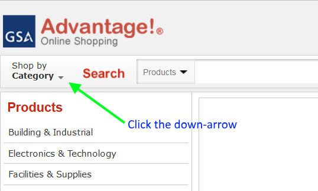
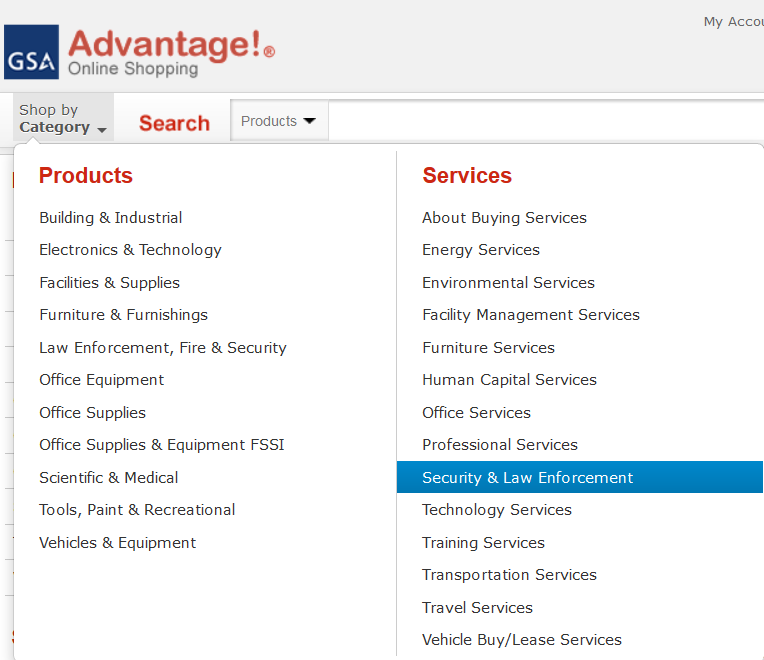
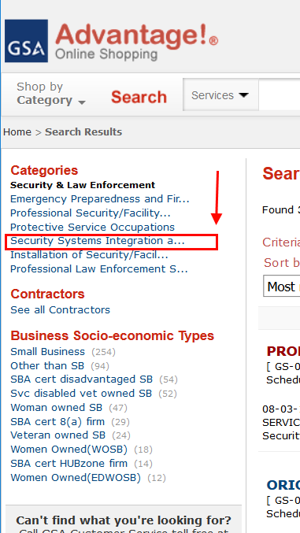

-----------------------------------------------------
##PACS Procurement
###The Statement of Work
After you've finished the risk analysis, presented it to the agency's Facility 
Security Committee (FSC), and the FSC 
has agreed on each location's assumed risks and countermeasures, you are ready
 to create a Statement of Work (SOW) for upgrades to the integrated security
platform in use at those locations.  Undoubtedly, you will be procuring PIV 
readers, a system to validate PIV cards when they are presented at the readers,
a physical security system (PACS) upgrade or possibly replace the PACS with
an entirely new brand.

The statement of work should include the material in GSA's [PKI in E-PACS Procurement Guidance](https://www.idmanagement.gov/IDM/servlet/fileField?id=0BEt0000000007z). 
This document provides language for Enterprise-level physical access control (E-PACS)
procurements documents such as Requests for Quotes (RFQs) and Statements of Work.
It includes all of the policies and normative guidance that requires agencies
procuring new systems to ensure that they implement the FIPS 201 authentication 
methods designed for use with E-PACS.

Two guides for creating a SOW can be found at [DHS](https://www.dhs.gov/sites/default/files/publications/isc-planning-managing-physical-security-resources-dec-2015-508.pdf) and 
[GSA](http://www.gsa.gov/portal/getMediaData?mediaId=206995).  You will need to 
modify these for security systems integration rather than strictly IT, but the
basic frameworks are in place for most of your project.

###Looking for Approved Systems
####Background
Physical access control systems have not advanced technologically at anywhere 
near the speed that other types of automated systems and equipment have.  Despite 
this, PACS vendors remain very protective of their technology.  You'll 
not find much commonality or compatibility from one vendor's system to the next.
FIPS 201 partially addressed this by forcing interoperability at the card-reader
level, but beyond that, every PACS uses a proprietary database schema, 
proprietary head-end-to-panel network protocols, and sometimes, proprietary 
panel-to-reader protocols.  

There are a few exceptions.  This didn't happen 
without the Government stepping in and strongly suggesting that a 
panel-to-reader protocol should be developed so that the Government could be 
free to mix and match readers with the rest of the PACS.  Open Supervised 
Device Protocol (OSDP), already a fledgling standard, was expanded to support 
the larger commands and responses used with PIV authentication, and is now 
found on a majority of PIV readers.  Later, we will discuss this feature.
###GSA FIPS 201 Approved Products List (APL)
To ensure that PACS and LACS products meet FIPS 201 security, usability, and 
interoperability standards set by International Organization for Standardization
 and International Electrotechnical Commission (ISO-IEC), 
National Institute of Standards and Technology (NIST), American National Standards
Institute (ANSI), Underwriters Laboratories (UL) and General Services Administration 
(GSA), GSA 
established a FIPS 201 Evaluation Program (FIPS 201 EP).  

Vendors submit end-to-end PACS solutions 
consisting of the PACS, a PIV card validation system, and one or more readers to the 
Evaluation Program test lab managed by the GSA.  Not only are products tested for 
compliance with the many standards issued by ISO-IEC, ANSI, UL, and GSA, but they 
are also tested for compatibility amongst themselves.  This ensures that when an 
agency procures a GSA-approved end-to-end solution, it is guaranteed to be 
compatible.  Vendors that update a listed product must submit an upgrade application, 
and the end-to-end solution is re-tested.
####How to Find Approved Products
Point your web browser to http://IDManagement.gov.
Scroll down and select _View Vendor Products and Services_ from the _I Want To_
 menu.
There are several categories in the Filter by _Category_ drop-down, but the most 
relevant are:
*  PACS Infrastructure
*  PACS Validation System
*  PACS and Validation Infrastructure
*  PACS PIV Reader  

It's important to understand what these categories mean, so we'll explain them 
before we start searching for products.
####PACS Topology 13.01
The first PACS topology approved by the GSA FIPS 201 EP was named 13.01. It 
consists of an implementation of a PACS Infrastructure and a PACS Validation 
System. The PACS Infrastructure category typically includes these subcomponents:  

* Database and Server
* Field Panel (Controller)
* Head-end Service (PACS application & server)
* Int. USB Card Reader/Writer & Fingerprint Capture
* Registration Station
* Single Fingerprint Capture Device
* Transparent USB Card Reader/Writer
* Workstation  

The PACS Validation System category includes a subset of these subcomponents:  

* Caching Status Proxy Server
* Cryptographic Module
* Int. USB Card Reader/Writer & Fingerprint Capture
* IRIS Capture Device
* Mobile Validation Device
* OSCP Client
* Path Validation Engine
* Registration Station
* SCVP Client
* Secure Controller
* Single Fingerprint Capture Device
* Transparent USB Card Reader/Writer

The PACS Validation System is all about electronically authenticating cards and
 cardholders.  This is the FICAM portion of any FICAM-based PACS.

####PACS Topology 13.02
The PACS Infrastructure and PACS Validation System can be combined into a single 
seamless system which is called a PACS and Validation Infrastructure (PVI). 
This topology is designated as PACS Topology 13.02.  The distinguishing feature
of a 13.02 PACS topology is that it is engineered and manufactured by a single 
OEM.  This can make it simpler and less expensive to purchase and install.

#####PIV Readers

The PIV Reader category has 3 subcomponents:  

* PIV Reader Single Factor
* PIV Reader Dual Factor
* PIV Reader Three Factor  

_Single factor_ PIV readers are used to perform CAK-AUTH, which ensures that the 
PIV card presented by the bearer is the same card that was registered in the 
PACS and the card has not been revoked.  A single factor PIV reader _does not_ 
help to identify the person presenting the card.  It simply identifies the card itself.  Single factor PIV readers are 
almost always contactless readers.

_Dual factor_ PIV readers are used to perform PKI-AUTH, which ensures that the 
PIV card presented by the bearer is the same card that was registered in the 
PACS and, because the second factor is a PIN, helps to identify the bearer.  

Note that someone could give their PIN to another person, who could then gain access 
using the card and PIN.  Dual factor readers use a contact slot to insert the card, 
and a PIN pad to enter the PIN.

_Three factor_ PIV readers perform PKI-AUTH like dual factor readers, but also 
require the bearer to present a biometric sample for comparison with the reference 
biometric template stored on the PIV card.  This is the strongest form of 
identification.  
####OSDP
Many PIV readers support OSDP.  Currently, using OSDP protocol to perform PIV-AUTH 
and CAK-AUTH is still in its infancy. 
<!--- TODO: We should explain that OSDP 
introduces processing overhead due to the message lengths, and that different 
vendors have taken vendor-specific approaches to handle this, but they may not be 
interoperable with other vendors' products. --> 
Most vendors supporting OSDP 
provide both the panel and the reader, thereby ensuring that the two work together.  This is 
what is tested and approved in the GSA EP lab.  In the Government's eyes though, 
the end state is when any approved PIV reader can be connected to 
any PACS Infrastructure.  Of course, all of these combinations of products will 
need to be tested by the GSA EP, but the goal is for the OSDP standard to become so 
well-defined, that the engineering effort to integrate another vendor's component 
will be like plugging in an electrical cord; it always works because the NEMA 
connector standards are rock-solid and all of the vendors interpret the 
specifications the same way.  

####Combination Readers
Some readers are able to perform as single, dual, or even three-factor readers, 
which allow you to vary the number of factors based on your security policy.  An 
example might be an entrance to a building where the lobby is manned during 
normal working hours, so a single factor is sufficient.  After hours, the lobby 
is unmanned, so two factors are required.  Some systems enable you to configure 
the same reader to change from one to two factors after hours and and back to one 
factor during working hours.  The ideal system allows you to configure readers
or groups of readers to switch authentication modes based on a time schedule with 
absolutely no user intervention.

At this point, you will have determined your needs for the required numbers of 
factors at each controlled access point, so it's time to look at what's available.  

The FIPS 201 APL section of the IDManagement.gov web site has been carefully 
crafted to link components from the categories mentioned above so that you can 
quickly see which have been tested for compatibility with each other.   This helps
 to eliminate the purchase of components that end up being incompatible or not 
 supported with your selected configuration.  
 
There are multiple ways to search for products.  If reader factors are a primary 
driver for your project, then select _PACS PIV Readers_ from the _Filter by Category_
drop-down menu.  Immediately, a list of all PACS PIV Readers will be displayed.  
Sort the list by the _Status_ column so that only the approved readers are shown. 
Note that when you search for PACS PIV readers, the number of factors is not 
usually displayed.  You'll need to read the product name, which will contain 
clues that indicate how many factors they support.  Some common examples are:

* Contactless (only, i.e., no PIN/keypad) means single factor 
* Contact/Contactless with PIN means dual factor  
* Bio always means a minimum of contact and PIN/keypad (because a PIN is  
required to access the biometric).  Bio readers almost always support PKI-AUTH 
(the first two factors).

To see what systems a particular reader has been tested and approved to work with, 
click the (+) icon in the leftmost column of the table.  For example, find 
_ACME Contact/Contactless Keypad Reader (APL #99999)_.   Note the part number 
shown inside the red box.  
TODO: Create image link of reader list with _ACME Contact/Contactless Keypad 
Reader_ highlighted with a green box.   Place a red box around the part number.
 
<!--- TODO: Show the matrix of PACS Infrastructure and PACS Validation Systems that 
work with this reader. -->
<pre>
   
</pre>
Now, click the (+) icon.  Beneath the reader, a table will be displayed showing 
the approved PACS Infrastructures, PACS Validation Systems that this reader will 
work with, as well as the reader itself.  The APL numbers are shown for each 
category item in a row.  You can now begin to look at PACS Infrastructures or PACS 
Validation Infrastructures to get a list of part numbers.
Click the APL# beneath a PACS Infrastructure on one of the rows that was 
displayed after you clicked the (+) icon.  In this example, we chose PACS 
Infrastructure for _Secure My Site (APL #99998)+.
<!--- TODO: Show the summary page for Secure My Site PACS Infrastructure.-->
<pre>
   
</pre>
Now, click on the [+] Product Configuration icon.  All of the part numbers 
associated with the tested system are shown.  In many cases, the vendor will 
test additional components (for example a 2- and 8-reader module to give 
customers flexibility in their installation).  Your systems integrator can 
assist you with selecting the right components here.
<!--- TODO: Create a screen capture to show the component breakout and circle the 
part numbers in a red box.-->
<pre>
   
</pre>
Navigate back to the PIV Reader list and find APL 99999 again.  Find the line 
containing the _Secure My Site (APL #99998)_ and select the _CryptoWhiz PACS 
Validation System (APL #99997)_.  When the _CryptoWhiz PACS Validation System for
 Secure My Site_ is displayed, click on the _[+] Product Configuration_ icon to 
 reveal the part numbers.
<!--- TODO: Create a screen capture to show the component breakout and circle 
the part numbers in a red box.-->
<pre>
   
</pre>
You have found all of the OEM part numbers that have been approved for an 
end-to-end solution for a dual-factor _ACME Contact/Contactless Keypad Reader_ 
used with a _Secure My Site PACS_ and the _CryptoWhiz Validation System_.  With 
this reader, there are several other end-to-end solutions, so this is where 
you work with your systems integrator to determine the best overall solution 
for your facility or agency.  

You can now begin to determine budgetary pricing by using GSAAdvantage.gov.  
Labor and materials for installation are not going to be able to determine 
without working with an integrator, so GSAAdvantage.gov is really only good for 
getting budgetary pricing for software and hardware for APL items. 
###GSA Advantage
Here's how to use GSAAdvantage.gov to obtain pricing for software and hardware..

####Point to the Web Site
Point your browser to https://www.gsaadvantage.gov.  When the site is displayed,
Click the little down-arrow on the _Shop by Category_ button.  

..

A two-column menu will be displayed.  On the _Services_ column, select _Security and Law Enforcement_.

..

Next page that displays has a list of categories in the left margin.  Under _Categories_, select the link to _Security Systems Integration and Design 
Systems_.  

..

The result is a list of systems integrators with GSA Schedule 70 or 84 who have
listed themselves with GSAAdvantage.  Not every integrator carries every part,
so you will need to look for the part first.  This will give you an idea of cost
and availability.

Search for the part number of the component found on the APL configuration form.
Either the product won't be found, or one or more System Integrators will offer
 the product.
<!--- TODO: Show a working example of an APL-listed part. -->
